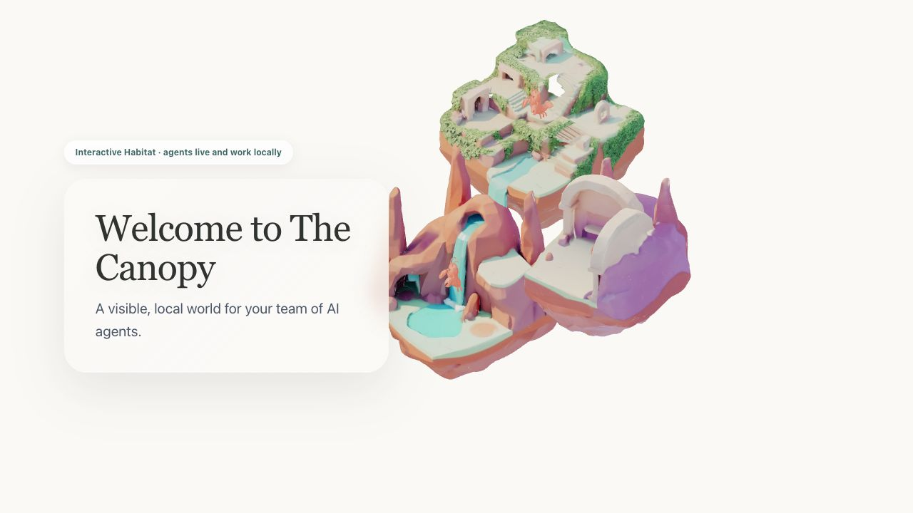
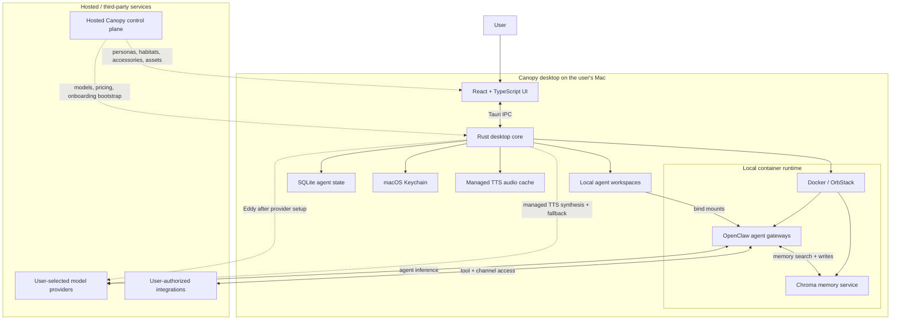

# Canopy

**A local-first desktop operating system for building, isolating, and supervising AI agents.**

> **Portfolio preview:** Thanks for taking a look. You are welcome to inspect, clone, build, and run Canopy for evaluation. The source is here to make the product, architecture, and implementation easy to explore. This is a portfolio preview rather than a general open-source release; see [LICENSE](LICENSE) for details.

Canopy turns a collection of model APIs, tools, and integrations into a visible team of agents. Each agent has its own identity, model configuration, credentials, workspace, permissions, and audit trail. The desktop app coordinates those agents while the execution plane stays in local containers on the user's Mac.

> **Project status:** active portfolio preview. The current build is macOS-first, under active development, and not yet intended for production use with high-stakes data or unattended financial actions.



*Canopy gives each agent a visible place in a shared, interactive 3D world while its runtime, credentials, and workspace remain locally managed.*

## Why this project exists

Most agent frameworks optimize for getting one autonomous loop running. Canopy explores the product and systems questions that appear after that:

- How does a user understand what several agents are doing?
- How should credentials and integrations be isolated per agent?
- Where should approval boundaries, budgets, and audit history live?
- How can agent state remain local without making setup feel like infrastructure work?
- How can multiple agents deliberate together without losing provenance or cost control?

The result is a Tauri desktop application with a React/Three.js interface, a Rust control plane, and a containerized local agent runtime.

## Highlights

- **Per-agent isolation** — model credentials, integrations, workspaces, and runtime configuration are explicitly scoped to an agent.
- **Local execution plane** — OpenClaw gateways and Chroma memory run in Docker-compatible containers bound to loopback interfaces.
- **Secure credential handling** — provider and integration secrets are stored in macOS Keychain, not source-controlled environment files.
- **Observable autonomy** — activity, approvals, budgets, browser sessions, and audit events are surfaced in one desktop interface.
- **Multi-agent forums** — agents can be assembled for structured collaboration with trust and spend controls.
- **Spatial identity** — agents and their habitats are rendered as a navigable 3D environment rather than a flat bot list.
- **Recoverable infrastructure** — diagnostics cover local engine health, gateway repair, model availability, and container recovery.

## Architecture

> Maintainer note: when major architectural or functional behavior changes, update this section and the diagram in the same pull request so the README stays operationally accurate.



The hosted control plane supplies public product configuration such as agent personas, habitats, accessories, visual assets, model metadata, pricing, and the bounded first-run Eddy bootstrap route. Agent workspaces, credentials, and runtime state are managed locally. OpenClaw mounts each agent workspace into the local container runtime, uses Chroma for memory search and storage, and sends agent inference directly to the provider selected by the user. Single-turn voice playback is also local-first: the React UI asks the Rust core to synthesize audio for a specific agent, the core first tries that agent's active model provider when it exposes native TTS, then falls through to other configured providers only if needed, writes a short-lived audio file into the managed voice cache, and the UI plays that cached file. Eddy follows a separate direct-from-the-Mac path after provider setup.

First-run onboarding has one deliberate exception so Eddy is still an AI before a user connects a key. The desktop can call `/api/canopy-helper/bootstrap` with one current setup request plus `runtime_ready`, an `active_view` fixed to `onboarding`, and the bounded onboarding step. Persona drafting and the pre-deploy test drive may include their bounded current task framing (including the current draft personality for a test drive) in that single request. Prior conversation turns, the agent roster, provider diagnostics, logs, credentials, permissions, workspaces, and instructions from existing agents are not added from app context. The route is onboarding-only and rate-limited; once any supported user provider key is present, Eddy automatically switches to direct provider calls from the Mac. An explicit local-only mode remains available.

## Quick start

### Prerequisites

The current preview is tested on macOS. You will need:

- macOS with Xcode Command Line Tools: `xcode-select --install`
- [Rust](https://rustup.rs/) stable
- Node.js 22.12 or newer
- [OrbStack](https://orbstack.dev/) or Docker Desktop, running
- 16 GB of system memory recommended for browser-heavy or multi-agent workflows
- An Anthropic, OpenAI, Gemini, or xAI API key to receive model responses

Vite 8 requires Node.js 20.19+ or 22.12+; this repository standardizes development and CI on Node 22.

### Run the desktop app

```bash
git clone https://github.com/ScottieR/canopy.git
cd canopy

# Standalone portfolio setup: use the hosted public catalog/control plane.
cp .env.production .env.development.local

npm ci
npm run tauri dev
```

On the first launch, Canopy will connect to the local container engine and may need to pull the pinned OpenClaw and Chroma images. That cold start is slower than subsequent launches.

During onboarding, add a provider key when prompted. The key is written to macOS Keychain and synchronized only into the selected agent's local runtime profile.

### Suggested five-minute walkthrough

1. Complete the local-engine check.
2. Create an agent from a suggested persona.
3. Give that agent its own model-provider credential.
4. Send a prompt and inspect the agent's workspace, activity, and audit history.
5. Create a Forum task to see multi-agent assignment and budget controls.

You can explore the interface without a provider key, but agents cannot produce model responses until one is configured.

## Environment configuration

`VITE_API_URL` selects the Canopy control-plane environment:

| File | Purpose |
|---|---|
| `.env.development` | Local full-stack development at `http://localhost:3001` |
| `.env.production` | Hosted public control plane used by packaged builds |
| `.env.development.local` | Ignored local override for desktop development |
| `.env.example` | Safe example containing public routing only |

For a standalone clone, copying `.env.production` to `.env.development.local` is the simplest path. If you are developing the separate admin service locally, keep the default `.env.development` instead.

Do not place API keys, OAuth client secrets, signing keys, or tokens in any `.env` file. Runtime credentials belong in the app's Keychain-backed credential store.

Optional integrations such as Slack, Google, GitHub, Telegram, and Discord require their own provider-side apps or tokens. They are not required for the core demo.

## Privacy boundaries

| Data | Default location / destination |
|---|---|
| Provider and integration credentials | macOS Keychain; agent-scoped runtime profiles are generated locally |
| Agent definitions, activity, budgets, and durable content | Local SQLite database |
| Agent identity, memory, and workspace files | Local application-support directory and container-mounted workspaces |
| Prompts and model responses | Sent from the local runtime to the model provider selected by the user |
| Persona catalogs, model metadata, pricing, and visual assets | Fetched from the hosted Canopy control plane |
| Usage telemetry | Disabled unless the user opts in; aggregate, anonymized events only |
| Canopy Helper after provider setup | Sent directly from the Mac to the user's provider or local Ollama; Rust allowlists one current message, minimized diagnostics, and short-lived continuity |
| Canopy Helper during first-run setup | One bounded current setup request plus runtime readiness and onboarding step goes to the hosted bootstrap; no prior turns or general diagnostic context |

Container services are published only on `127.0.0.1`. Host-level computer control is treated as a separate, higher-risk capability and is restricted to isolated agents.

## Development commands

```bash
# Frontend checks
npm run typecheck
npm test -- --run
npm run build

# Rust checks
cd src-tauri
cargo check
cargo test
cargo audit
```

Run `npm run tauri dev` for the complete application. `npm run dev` starts only the Vite frontend and does not provide the Rust/Tauri APIs required by most product flows.

See [the testing guide](docs/engineering/testing.md) for the broader regression strategy and [the refactoring regression plan](docs/engineering/refactoring-regression-plan.md) for the current refactor gates.

Before publishing a fork or changing this repository's visibility, work through [PUBLIC_RELEASE_CHECKLIST.md](PUBLIC_RELEASE_CHECKLIST.md).

## Repository map

```text
src/                         React UI, stores, orchestration, and 3D world
src-tauri/src/               Rust commands, persistence, security, and containers
shared/                      Shared agent and model metadata
templates/                   Agent templates, identities, and primers
public/                      Runtime web assets
scripts/                     Repeatable development and validation scripts
docs/                        Architecture, product, design, and testing notes
.github/workflows/           Security and regression CI
```

Key entry points:

- `src/App.tsx` — application shell and startup orchestration
- `src/pages/OnboardingWizard.tsx` — first-run and agent-creation flow
- `src/store/worldStore.ts` — desktop world and persisted UI state
- `src-tauri/src/lib.rs` — Tauri application wiring
- `src-tauri/src/openclaw.rs` — agent runtime coordination
- `src-tauri/src/keychain.rs` — Keychain-backed credential vault and IPC allowlist
- `src-tauri/src/db.rs` — SQLite persistence

## Security model

Canopy follows three core rules:

1. **No implicit credential inheritance.** An agent without an explicitly scoped integration credential remains disconnected.
2. **The frontend never executes shell commands directly.** Privileged work crosses typed Tauri commands into the Rust layer.
3. **High-risk capabilities are observable and bounded.** Computer control, external writes, and financial actions require explicit permissions and approval paths.

CI scans the full Git history for secrets, audits JavaScript and Rust dependencies, type-checks the frontend, runs the Vitest suite, and builds the production bundle.

If you find a security issue after this repository becomes public, follow [SECURITY.md](SECURITY.md) and use GitHub's private vulnerability-reporting flow rather than opening a public issue.

Visual and generated-asset origins are documented in [docs/asset-provenance.md](docs/asset-provenance.md).

## Contributions

This evaluation release is not currently accepting outside contributions. Security reports remain welcome through the private process in [SECURITY.md](SECURITY.md). Authorized collaborators should read [CONTRIBUTING.md](CONTRIBUTING.md) before changing security boundaries, credential handling, Tauri commands, or agent isolation behavior.

## Current limitations

- macOS is the supported desktop target for this preview.
- The first launch requires a working Docker-compatible engine and network access to pull runtime images.
- Full agent responses require a user-supplied model-provider credential and may incur provider charges.
- Some optional integrations require separate OAuth application configuration.
- The UI and Rust core are being split from several large legacy modules; the regression plan tracks that work.

## License

Canopy is shared as a portfolio preview under a limited evaluation license. Reviewers are welcome to inspect, clone, build, and run it. See [LICENSE](LICENSE) for the full terms.
